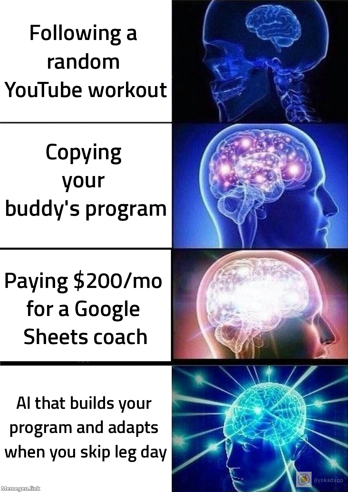
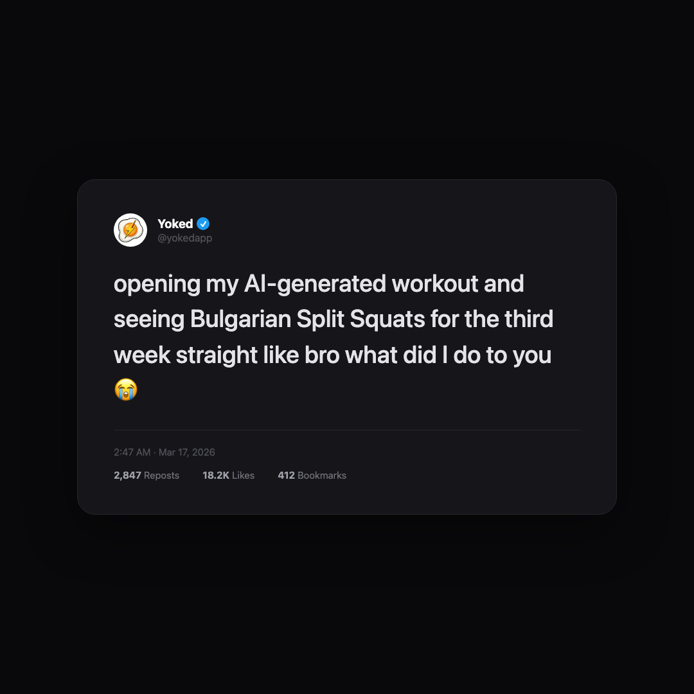
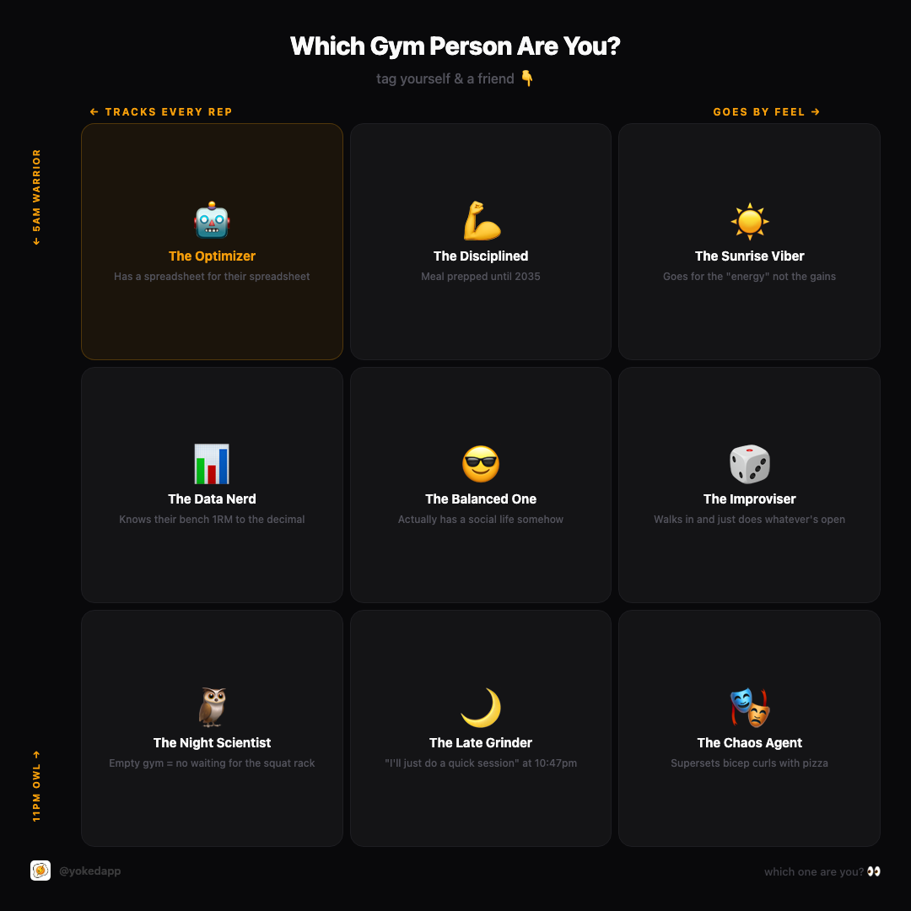
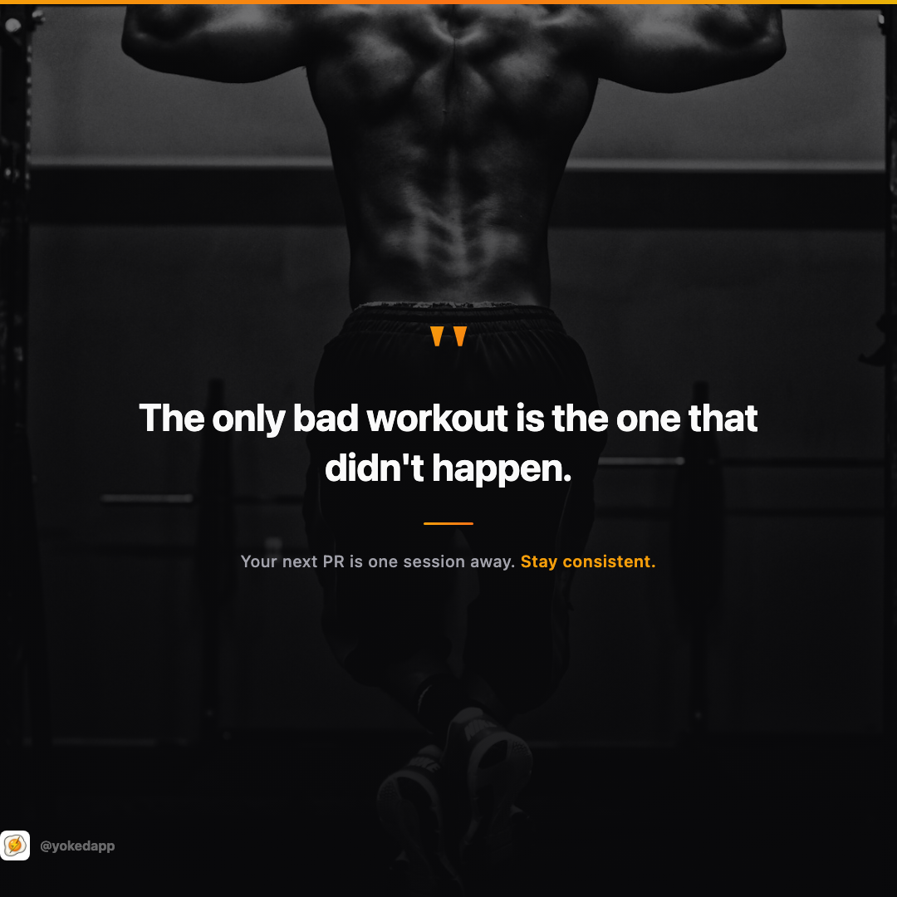
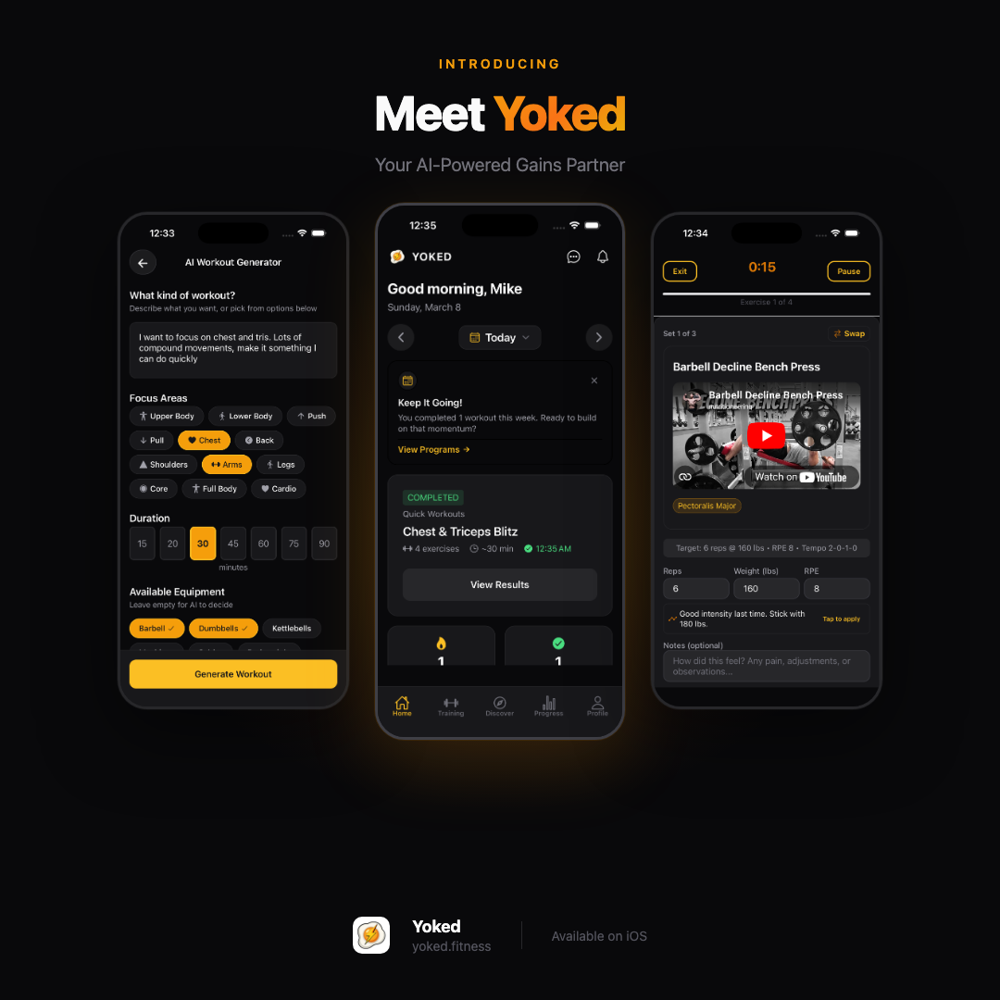

# Social Machine

AI-powered social media marketing pipeline for Claude Code.

Social Machine turns your project into a content machine. It scans your codebase for brand identity, researches current trends, generates post ideas with captions, creates publish-ready graphics (including real meme templates), and saves everything for you to post — all from `/social`.

## Install — takes 30 seconds

**Requirements:** [Claude Code](https://docs.anthropic.com/en/docs/claude-code), [Git](https://git-scm.com/)

### Step 1: Install on your machine

Open Claude Code and paste this. Claude does the rest.

> Install Social Machine: run **`git clone https://github.com/michaelsaia/social-machine-skill.git ~/.claude/skills/social-machine-skill && cd ~/.claude/skills/social-machine-skill && ./setup`** then add a "social-machine" section to CLAUDE.md that says to use the `/social` skill from social-machine-skill for social media content creation, and lists the available skills: `/social`, `/social-config`, `/social-scan`, `/social-research`, `/social-ideate`, `/social-meme`, `/social-stock`, `/social-design`, `/social-capture`, `/social-post`. Then ask the user if they also want to add Social Machine to the current project so teammates get it.

### Step 2: Add to your repo so teammates get it (optional)

> Add Social Machine to this project: run **`cp -Rf ~/.claude/skills/social-machine-skill .claude/skills/social-machine-skill && rm -rf .claude/skills/social-machine-skill/.git && cd .claude/skills/social-machine-skill && ./setup`** then add a "social-machine" section to this project's CLAUDE.md that says to use the `/social` skill from social-machine-skill for social media content creation, and lists the available skills: `/social`, `/social-config`, `/social-scan`, `/social-research`, `/social-ideate`, `/social-meme`, `/social-stock`, `/social-design`, `/social-capture`, `/social-post`.

Real files get committed to your repo (not a submodule), so `git clone` just works. Everything lives inside `.claude/`. Nothing touches your PATH or runs in the background.

Navigate to any project and run `/social`. It will walk you through setup on first run.

## What You Need

### Included (works out of the box)

| Tool | What it does | Setup |
|------|-------------|-------|
| **memegen.link API** | 200+ real meme templates (Drake, Expanding Brain, etc.) | None — free, no auth, no API key |
| **Pillow** (Python) | Watermarks memes with your brand logo + @handle | Auto-installed in a temp venv by `./setup` |
| **WebSearch** | Trend research, stock image discovery | Built into Claude Code |

### Recommended

| Tool | What it does | Setup |
|------|-------------|-------|
| **Playwright** | Screenshots HTML/CSS graphics at exact dimensions | `npx playwright install chromium` |
| **gstack** | Headless browser for screenshots + QA (alternative to Playwright) | [github.com/garrytan/gstack](https://github.com/garrytan/gstack) |

### Optional (unlock extra features)

| Tool | What it unlocks | Setup |
|------|----------------|-------|
| **Figma MCP** | Design graphics in Figma instead of HTML/CSS | [Figma MCP server](https://github.com/anthropics/anthropic-tools) |
| **iOS Simulator** | Capture live app screenshots for graphics | Xcode + `xcrun simctl` |
| **Platform API keys** | Direct posting to X, Instagram, TikTok | Guided setup via `/social-config` |

## Examples

All generated by Social Machine for [Yoked](https://yoked.fitness), an AI fitness app. Zero manual design work.

### Real Meme Templates (memegen.link API)

Pulls from 200+ classic meme templates, adds your text, and watermarks with your brand logo.

<p align="center">
  
</p>

> **Expanding Brain** — Real template via memegen.link API. Brand logo + @handle auto-watermarked. Text generated by the style transfer engine which adapts trending formats to your product.

### Custom Meme Layouts (HTML/CSS)

For formats without a classic template image — alignment charts, tweet cards, hot takes, etc.

<p align="center">
  
  &nbsp;&nbsp;
  
</p>

> **Tweet Screenshot** (left) — Realistic tweet card with brand avatar, handle, and verified badge. The humor does the marketing.
>
> **Alignment Chart** (right) — "Which one are you?" grid designed to drive comments and tags. Brand accent color highlights the target persona.

### Branded Graphics + Stock Photography

Finds royalty-free images from Unsplash/Pexels/Pixabay, tracks licenses, and composites them into branded graphics.

<p align="center">
  
</p>

> **Quote Card** — Stock photo from Unsplash (license tracked in `LICENSES.md`). Dark gradient overlay for readability. Brand colors on accents. Generated from a single content brief.

### App Screenshots + Device Mockups

Captures live screenshots from iOS Simulator or browser and frames them in device mockups.

<p align="center">
  
</p>

> **App Introduction** — Three real app screenshots captured from the iOS Simulator, framed in phone mockups. Headlines and branding pulled from the auto-scanned brand profile.

---

## How It Works

```
┌─────────────────────────────────────────────────────────────────┐
│                        /social                                  │
│                     (orchestrator)                               │
└──────────────────────────┬──────────────────────────────────────┘
                           │
              ┌────────────▼────────────┐
              │   First time? Run setup │
              │   /social-config        │──── Pick providers, platforms, meme pref
              │   /social-scan          │──── Auto-extract brand from codebase
              └────────────┬────────────┘
                           │
              ┌────────────▼────────────┐
              │   /social-research      │──── Search trends in your niche
              │   (skippable)           │     via WebSearch
              └────────────┬────────────┘
                           │
              ┌────────────▼────────────┐
              │   /social-ideate        │──── Pick content type + generate
              │                         │     3 caption variants (question /
              │                         │     stat / story hooks)
              └────────────┬────────────┘
                           │
                    ┌──────┴──────┐
                    │             │
           ┌───────▼──────┐  ┌───▼──────────┐
           │ /social-meme │  │ /social-stock │
           │ (if meme)    │  │ (if photo bg) │
           │              │  │               │
           │ Scout trends │  │ Unsplash /    │
           │ Style xfer   │  │ Pexels /      │
           │ 200+ formats │  │ Pixabay       │
           └───────┬──────┘  └───┬──────────┘
                   │             │
              ┌────▼─────────────▼──────────┐
              │   /social-design            │
              │                             │
              │   Routes to provider:       │
              │   ├─ html-screenshot        │──── HTML/CSS → Playwright screenshot
              │   ├─ memegen-api            │──── Real meme templates + watermark
              │   ├─ figma                  │──── Figma MCP (optional)
              │   └─ svg                    │──── Pure SVG fallback
              └────────────┬────────────────┘
                           │
              ┌────────────▼────────────┐
              │  /social-capture        │──── iOS Simulator or browser
              │  (optional)             │     screenshots
              └────────────┬────────────┘
                           │
              ┌────────────▼────────────┐
              │   /social-post          │
              │                         │
              │   Routes to provider:   │
              │   ├─ manual (default)   │──── Save files + caption for you to post
              │   ├─ api                │──── Direct API posting (Phase 2)
              │   └─ browser            │──── Browser automation (Phase 2)
              └────────────┬────────────┘
                           │
              ┌────────────▼────────────┐
              │   Log to history        │──── Track what was posted for
              │   Suggest next post     │     content variety
              └─────────────────────────┘
```

Every stage works independently (`/social-meme`, `/social-stock`, etc.) or chains together via `/social`.

## Per-Project State

Social Machine stores all project-specific data in `.social-machine/`:

```
.social-machine/
├── brand.md            # Brand identity (auto-generated from codebase)
├── config.md           # Provider and platform settings
├── credentials.env     # API keys (auto-gitignored)
├── research-latest.md  # Latest trend research
├── history/
│   └── posts.md        # Post history for variety tracking
└── output/             # Generated graphics, captions, stock photos
    ├── stock/           # Downloaded stock images + LICENSES.md
    └── captions/        # Platform-specific caption files
```

## Who This Is For

- **Indie hackers** who built something cool but don't know how to market it
- **Solo founders** who don't have time for a content calendar
- **Developers** who'd rather type `/social` than open Canva
- **Small teams** who want consistent branded content without a design hire

## Roadmap

### What's Built

Brand scanning, trend research, content ideation with 3 caption variants, 8 content types, HTML/CSS branded graphics, meme engine with 200+ real templates and custom layouts (alignment charts, tweet cards, hot takes, starter packs), auto-watermarking, royalty-free stock photo sourcing with license tracking, iOS Simulator screenshots, device mockup generation, multi-platform dimension targeting, post history with variety tracking, project-type content adaptation, configurable providers, and guided first-time onboarding.

### What's Next

We want to expand Social Machine to handle **posting and scheduling** as part of the skill — direct API posting to X, Instagram, and TikTok so you can go from idea to published without leaving the terminal. Beyond that, video content (ElevenLabs voiceover, screen recordings, auto-captions) and smarter content intelligence (auto-detecting shipped features from git log, learning which content types perform best).

See [TODOS.md](TODOS.md) for the full backlog.

## Contributing

PRs welcome! If you build a new provider (graphics, video, or posting), add a `.md` file
in the appropriate `providers/` directory and update `CLAUDE.md`.

## License

MIT
